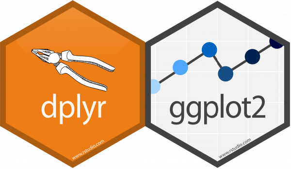
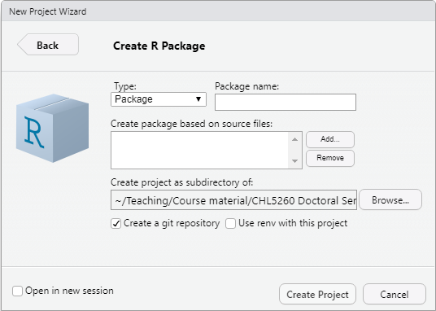
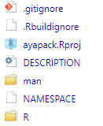

How to write an R package and publish it on GitHub
========================================================
author: Aya Mitani
date: January 14, 2021
width: 1440
height: 900
font-family: 'Helvetica'


What is an R package?
========================================================
- Collection of code, data, documentation developed by R community
- Addresses particular problem with specialized statistical technique, graphical device, etc. 
- Core set of packages come with base R
- >15,000 Additional packages available from CRAN, Bioconductor, Omegahat, GitHub, etc.
- Popular R packages 
  + `dplyr`
  + `ggplot2`

<div align="center">

</div>


What is GitHub?
========================================================

- Website that hosts software development and version control using Git
- Free basic services
- Truly open source
- ``Facebook for programmers''

<div align="center">

</div>


Why write an R package?
========================================================

**For yourself**
  + Save time 
    - Keep track of your functions
    - Have all your functions in one place
  + Document your work
  + For publishing papers
    - Increasingly, (bio)statistical journals ask for R package development of a novel method
    
**For others**
  + If the package is useful to you, it is also useful to someone else
  + Readers of your paper can use the proposed method
  + Advance science!


Why publish your package on GitHub?
========================================================
- Reproducibility
- Accessibility
- Collaboration
- Back-up method
- Version-control using git (more on this later)


What do you need to write an R package?
========================================================
- R Studio (https://rstudio.com/)
- `devtools` \& `roxygen2` \& `usethis` packages
- Git (install from https://git-scm.com/)
- GitHub account (https://github.com/)

### Some other useful packages

- `here` 
- `available`

<div align="center">

</div>


Major steps
========================================================

1. Open R Studio
    * New Project $\rightarrow$ New Directory $\rightarrow$ R Package $\rightarrow$ Enter info $\rightarrow$ Create Project
2. Edit your package
    * Each function should be saved in its own file
    * Write package description and document functions
    * Include some data 
    * Write a vignette 
3. Create new repo in GitHub
    * Repo name $=$ package name
4. Connect to GitHub
5. Pull + Commit + Push
6. Use/share package with `install_github()`

**There is more than one way!**


Naming your R package
========================================================
### Some tips

* Make it simple \& short
* Make it unique (use `available` package -- see next slide)
* Must start with a letter \& cannot end with a period
* Do not use special characters
* Trend towards using all lower case
* Hadley's book has [more information](https://r-pkgs.org/workflows101.html?q=naming#naming)


Naming R package
========================================================

Check to see if the name is unique, especially if you plan to submit your package to CRAN


```{.r .bg-warning}
install.packages("available")
library(available)
available("ayapack", browse = FALSE)
```


First step in RStudio
========================================================
* New Project $\rightarrow$ New Directory $\rightarrow$ R Package
  - Enter package name
  - Optional: Select R scripts that include your functions (if you leave blank, a default function is included)
  - Select subdirectory where you want to save the package (location is not too important since the final product will be saved on Github)
  - Check `Create a git repository`

<div align="center">

</div>


This will create the following files and folders
========================================================

* **packagename.Rproj**: This indicates that the directory is a project
* **DESCRIPTION**: This is where all the meta-data about your package goes -- you can edit this file manually 
* **NAMESPACE**: This file indicates what needs to be exposed to users for your R package -- we will recreate this file using `document()` (see next slide)
* **R**: This is where all your R code goes for your package
* **man**: This is where the manuals for your functions will be saved
* Don't worry too much about the rest (.gitignore, .Rbuildingore)


<div align="center">

</div>


Document using roxygen
========================================================
* Next, load the packages

```{.r .bg-warning}
library(devtools)
library(roxygen2)
library(usethis)
```

* Then, delete the NAMESPACE file
* Document your function by adding `roxygen` comments (see next slide)
    + Comment lines that begin with #’
    + Place comment lines directly above the function
    + Place @ tag after #’ to supply a specific section 
    + Untagged lines will be used to generate a title, description, and details section (in that order)


Document using roxygen
========================================================

```{.r .bg-warning}
#' @title inverse logistic link function
#' @description a function that returns the inverse of the logistic link function
#' @param x numeric vector
#' @return y
#' @author Aya Mitani
#' @examples
#' expit(2)
#' @export

expit <- function(x){
  y <- exp(x) / (1 + exp(x))
  return(y)
}
```


Document using roxygen
========================================================

When you are finished with the comments, use `document()` to convert roxygen comments into
documentation


```{.r .bg-warning}
devtools::document()
```

This will create 

* `myexpit.Rd` inside `man` direcotory  
* `NAPESPACE`

Both are read only -- **NEVER edit these files by hand!**

View the help file 

```{.r .bg-warning}
?myexpit
```


Edit the DESCRIPTION file
========================================================

### Your package information

The `DESCRIPTION` file is pre-generated by `roxygen2`


```{.r .bg-warning}
Package: ayapack
Type: Package
Title: What the Package Does (Title Case)
Version: 0.1.0
Author: Who wrote it
Maintainer: The package maintainer <yourself@somewhere.net>
Description: More about what it does (maybe more than one line)
    Use four spaces when indenting paragraphs within the Description.
License: What license is it under?
Encoding: UTF-8
LazyData: true
RoxygenNote: 7.1.1
```

You **can** edit the `DESCRIPTION` file by hand


Edit the DESCRIPTION file
========================================================

### Dependencies 

If your package **depends** on other packages or you want to **suggest** other packages, then include them in the DESCRIPTION file

For example, if you require `survival` and suggest `ggplot2`, then

```{.r .bg-warning}
usethis::use_package("survival")
usethis::use_package("ggplot2", "suggests")
```
will add `survival` under `Imports` and `ggplot2` under `Suggests`

```{.r .bg-warning}
Imports: 
    survival
Suggests: 
    ggplot2
```


Include data sets
========================================================

**Example data sets** are very useful for demonstrating your functions

* Create a subdirectory `data/` 
* Import existing data or generate your own data


```{.r .bg-warning}
# I like to use the here package to locate my files
library(here)
exdata <- read.table(here("exdata.txt"), header = TRUE)
# Alternatively, you can specify the exact location to your file by writing out the full path
```

* Save with `.rda` extension in `data/` 

```{.r .bg-warning}
use_data(exdata)
```


Describe your data
========================================================
Every data set should come with a description

* Create a `.R` file and add `roxygen` comments
* Write the name of the data at the end (see next slide)
* Save the file in `R/` subdirectory 
* `devtools::document()` to convert the comments to documentation
* See the documentation by `?exdata`

Describe your data
========================================================

### Quick example


```{.r .bg-warning}
#' Example data
#'
#' Data from a toxicology study blah blah blah
#'
#' @docType data
#' @format A data frame with 1028 rows and 4 variables:
#' \describe{
#'   \item{LitID}{Litter ID}
#'   \item{Dose}{Dose of ethylene glycol (EG) administered}
#'   \item{FetalWt}{Fetal weight}
#'   \item{FetalMal}{Indicator for fetal malformation}
#' }
#' @source https://content.sph.harvard.edu/fitzmaur/ala2e/
#' @references Price, C.J., Kimmel, C.A., Tyl, R.W. and Marr, M.C. (1985).
#' The developmental toxicity of ethylene glycol in rats and mice.
#' Toxicological Applications in Pharmacology, 81, 113-127.
"exdata" 
```


Write a vignette
========================================================

Vignettes are very popular now. They are like **tutorials** for your package. 

Use [R Markdown](https://rmarkdown.rstudio.com/) to write your vignette

### Resources for writing vignettes

* https://r-pkgs.org/vignettes.html
* https://kbroman.org/pkg_primer/pages/vignettes.html

### Example of a vignette

* [Source code](https://github.com/tidyverse/dplyr/blob/master/vignettes/dplyr.Rmd)
* [In action](https://cran.r-project.org/web/packages/dplyr/vignettes/dplyr.html)


Check your package
========================================================

This is easy to do

```{.r .bg-warning}
devtools::check()
```
Fix any errors that come up and rerun until no errors are detected

You can also perform a spell check by

```{.r .bg-warning}
devtools::spell_check()
```


Connect to GitHub
========================================================

* Download [Git](https://git-scm.com/downloads) 
  + Set your username in Git
  + Set your commit email address in Git
* Create a [GitHub](https://github.com/) account
  + Create a new repository
  

Introduce yourself to Git
========================================================
### Set your username and commet email address in Git
Open **Git Bash** (in Windows) or **Terminal** (in Macs) and type

```{.r .bg-warning}
git config --global user.name "My Name"
git config --global user.email "myemail@email.com"
```

To confirm

```{.r .bg-warning}
git config --global user.name
git config --global user.email
```

Or use **R**

```{.r .bg-warning}
library(usethis) 
use_git_config(user.name = "My Name", user.email = "myemail@email.com")

# to confirm, generate a git situation-report, your user name and email should appear under Git config (global)
git_sitrep()
```


Create a new repository in GitHub
========================================================
* Repository name should equal the package name
* 
* Copy the URL to your repository


Push your package to GitHub
========================================================
Open Terminal in RStudio (Tools $\rightarrow$ Terminal $\rightarrow$ New Terminal)


```{.r .bg-warning}
git remote add origin 
git add .
git commit -m "initial commit"
git push origin master
```


Version control
========================================================
After you first push your package to GitHub, any updates you make should be 

Great resources
========================================================

* [Book by Hadley Wickham and Jenny Bryan](https://r-pkgs.org/)
* [Happy Git and GitHub for the useR](https://happygitwithr.com/)
* [devtools cheatsheet](https://rstudio.com/wp-content/uploads/2015/03/devtools-cheatsheet.pdf)
* [Blog post by MZES Social Science Data La](https://www.mzes.uni-mannheim.de/socialsciencedatalab/article/r-package/)
* [Tutorial by Karl Broman](https://kbroman.org/pkg_primer/)
* [Writing R Extensions](https://cran.r-project.org/doc/manuals/r-release/R-exts.html)

  
Two column slide
====================================
First column (Will appear on left)

***
Second column (Will appear on right)
